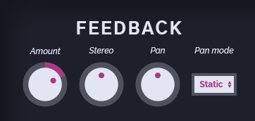
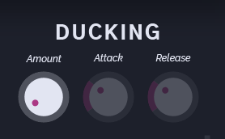
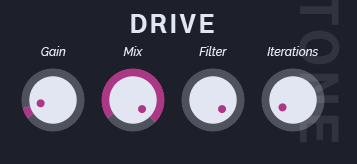

# Cocoa Delay Manual

**Cocoa Delay** is an audio plugin that adds echo effects to sounds. It takes the input signal, modifies it, and then writes it to a buffer that will played back with a certain delay. This signal, as well as the input signal, will be written to the buffer again, and so on.

## Time section

The time section affects the timing of echoes.

- **Delay**
	- **Time** - adjusts the delay time from 10 milliseconds to 2 seconds.
	- **Tempo sync** - sets the delay time to a certain note length based on the tempo of the project.
		- Note: when set to anything other than "Off", this overrides the time knob. The time knob will be grayed out to reflect this.
- **LFO**
	- **Amount** - sets the amount of oscillation to apply to the delay time.
	- **Frequency** - sets the speed of the oscillation from 0.1Hz to 10Hz.
- **Drift**
	- **Amount** - sets the amount of random fluctuation of the delay time.
	- **Speed** - sets the speed of the fluctuation.

## Feedback section

The feedback section affects the sound of the echoes.

- **Amount**: sets the volume of the signal to feed back into the buffer.
	- When the feedback knob is set to the 12 o'clock position, there will still be one echo.
	- When the knob is turned to the left, the signal will be inverted each time it is written to the buffer. This results in some slight destructive interference, which can make sounds seem less "heavy" or "muddy". Set to taste.
- **Stereo**: sets the difference in delay time between the left and right channels, creating a stereo widening effect.
- **Pan**: sets the amount and direction the echoes should be panned.
- **Pan mode**: sets the way audio should be panned.
	- **Static**: the position of the echoes does not move.
	- **Ping pong**: the echoes bounce back and forth between the left and right channel
	- **Circular**: the signal is panned further and further each time it is written to the buffer. Sounds will eventually loop back around to the other side. Try it, it's weird sounding!

## Ducking

The ducking section allows you to to decrease the volume of the echoes when the input signal is louder, creating an effect much like sidechain compression.

- **Amount**: sets the amount of ducking to perform.
- **Attack**: sets how quickly the volume level responds to increases in the input signal.
- **Release**: sets how quickly the volume level returns to normal when the input signal decreases.

## Filter

The filter section allows you to remove high or low frequencies from the signal each time it is written to the buffer, making each echo sound duller or brighter.

- **Mode** - sets the low-pass filter type.
	- **1P** - a 6dB one-pole filter with a gentle, smooth sound.
	- **2P** - a 12dB two-pole filter with a steeper cutoff.
	- **4P** - a 24dB four-pole filter with a clear cutoff.
	- **SVF** - a state variable filter with a more resonant sound.
- **Low cut** - sets the frequency above which sounds will be removed.
- **High cut** - sets the frequency below which sounds will be removed.

## Drive

The drive section adds a subtle (or un-subtle) saturation effect to the signal before it is written to the buffer.

- **Gain**: sets the amount to boost the audio before applying saturation. Turn this knob all the way to the left to bypass the drive section completely.
- **Mix**: sets the amount of saturated audio to mix with the unsaturated audio.
- **Filter**: sets the cutoff of a low-pass filter to apply to the audio after saturation. The filter is a 12dB two-pole filter.
- **Iterations**: sets the number of times to run the signal through the drive section, from 1 to 16. Higher values can give a thicker, lusher distortion at the cost of increased CPU usage.
